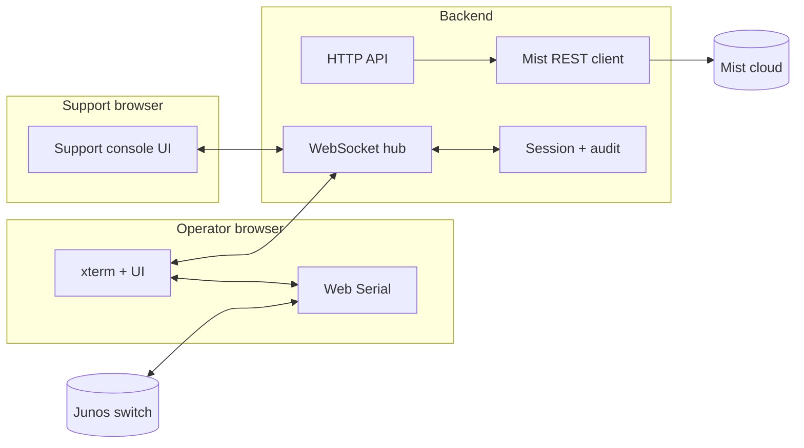

# Junos Console — Web Serial Terminal

A browser-based serial terminal and automated troubleshooting tool for Juniper Mist switches running Junos, via USB-C or RJ45 console connection.

**Audience:** Operators who may not be deeply technical—often a switch that is **disconnected in Mist** and needs console-side diagnosis or adoption. Long term, the experience should be launchable from the Mist UI (for example “Troubleshoot via console”) so the user only opens a URL in Chrome or Edge and plugs in a cable—**no local install of Node, npm, or Vite** in production.

---

## Hackathon & reviewer guide

This section aligns the README with **hackathon judging** (customer impact, self-driving depth, production readiness, broad applicability, Mist-native use, innovation) without replacing the technical documentation below.

### Problem statement

Mist-managed **EX** switches that are **offline or never adopted** still show up as operational pain: someone must **physically console in**, **guess** at WAN/DNS/firewall issues, **correlate** with what Mist *intended* for config, and often **loop support**. This tool **shortens that path**: one browser session, **Mist API context** (org/site/inventory/config/adoption), **automated CLI checks** with **critical gates**, optional **remote assist**, and **guided adoption**—so “disconnected switch” is **detected, diagnosed, and moved toward remediation** faster.

### Self-driving capability (Levels 1–3)

| Level | Meaning | How this project implements it |
|-------|---------|--------------------------------|
| **1 — Intelligent detection** | Automatically surface problems using Mist + device signals | **Identify switch** (inventory match), **config drift** (Mist vs running), **cloud connectivity suite** (uplink/IP/route/DNS/Mist endpoints/agent), **Mist status** / **firewall policy** checks |
| **2 — Automated diagnosis** | Reason about root cause from correlated data | **Ordered checks** with **stop conditions** (e.g. no mgmt IP → skip downstream); **LLDP + Mist upstream port context** when API is configured; **SSL inspection** and **traceroute on failure**; **offline timeline** (events + logs) |
| **3 — Autonomous action** | Fix or mitigate with clear safety boundaries | **Adoption workflow** (API-fetched commands + root pre-check + apply via console); **actionable remediation** text; **remote session** for guided/assisted intervention; *deliberately operator-in-the-loop for risky config on production hardware* |

### Customer impact (why deploy)

- **Faster time-to-cloud** for new or strayed switches (adoption + connectivity clarity).
- **Less tribal knowledge**—junior ops can follow **structured checks** and Mist-backed context.
- **Support efficiency**—same **session ID** + mirrored console reduces **“what do you see?”** loops.
- **Same pattern at every site** that uses Mist + EX (branch, retail, campus, healthcare, education).

### Mist-native integration

- **Mist REST API** (via server proxy): sites, site settings (e.g. root password hint path), **org inventory**, **per-device config**, **adoption / outbound SSH command** endpoint, **device events**, **stats**, **org logs** (as used in code—see `mist-api.service.ts` and `troubleshoot.service.ts`).
- **Regional cloud config** (`mist-clouds.config.ts`) aligned with Mist **API hosts** and **switch-facing endpoints** for checks.
- **Room to extend** with more analytics/events/Marvis-adjacent flows via the same backend pattern.

### Production readiness & security (submission checklist)

- **Setup:** [Getting Started (development)](#getting-started-development) — `npm install`, `npm run dev`, Chrome/Edge for Web Serial.
- **Errors:** Mist API errors surfaced in UI; serial/WebSocket failures messaged in-terminal.
- **Documentation:** Architecture (current + proposed), module map, feature list, design decisions.
- **Example outputs:** Run **Cloud connectivity check** and **Mist status** with a live or lab switch; capture screenshots for the deck (terminal + sidebar results). Optional: support console mirror screenshot.
- **Security:** API token in browser today (mitigated by **server-side proxy** toward Mist); **remote session IDs are secrets**—document need for **SSO/auth** before production scale; see [Security and consent](#security-and-consent-cross-cutting).

### Innovation highlights

- **Web Serial** + **xterm** for **zero-agent** console access from the field.
- **Shared console session** over WebSocket (support / future **agent** integration point).
- **Node backend** path for **hosted** deployment and **consistent** Mist access.

---

## Proposed architecture

The direction is a **thin browser client** plus a **real backend**. The browser keeps responsibility for anything only it can do (**Web Serial**); the server owns **Mist API access**, **sessions**, **transcripts**, and **integration points** for humans (Mist Support) and automation (AI agents).

### Goals

| Goal | Approach |
|------|----------|
| **Light end-user client** | Ship static assets (HTML/JS/CSS) from a normal HTTPS origin; users only need Chrome or Edge and Web Serial. |
| **No CORS hacks in the browser** | Mist REST calls run **server-side** (`fetch`/`https` to Mist), not via a browser-only proxy. |
| **One place for “smart” logic** | Sessions, auditing, rate limits, and future agents attach to the **backend**, not scattered in the page. |
| **Dev still simple** | Developers run the stack **locally** (frontend dev server + API process, or a unified `npm run dev`). |

### High-level diagram (conceptual)



### Serial path: hybrid (recommended default)

**Web Serial exists only in Chromium-based browsers**; Node cannot replace it without different hardware deployment (for example `node-serialport` on a host with the USB cable).

The **recommended** model keeps today’s UX:

1. The **operator’s browser** selects the serial port and writes/reads bytes via the Web Serial API.
2. A **WebSocket** to the backend carries framed traffic (for example device RX as `rx`, and TX from various sources as `tx` with a **source** field: `operator`, `support`, `automation`).
3. The **backend** fans out RX to authorized participants and enforces **who may inject TX** (policy, consent, revocation).

An alternative—**serial entirely on the server**—is possible for fixed labs but changes deployment (always-on machine with the cable). The hybrid model matches “plug USB into the laptop that already has the browser open.”

### Backend responsibilities

- **HTTP API** — Sites, inventory, adoption payloads, config drift inputs, org/site context from query params when launched from Mist, short-lived tokens, health.
- **WebSocket / session hub** — Join by session ID; multiplex `rx`/`tx`; optional **view-only** vs **interactive** support mode; hard **session end** when the operator revokes access.
- **Mist integration** — Server-held credentials (per deployment policy), no reliance on browser CORS to Mist.
- **Extensibility** — Same session channel can later serve an **LLM agent** (tool calls that emit `tx` and consume `rx`) with different auth than human support.

### Deployment: production vs development

| Environment | Operator | Developers |
|-------------|----------|------------|
| **Production** | Open `https://…` (and ideally from a Mist deep link); WebSocket + HTTPS API to **your** domain. | N/A |
| **Development** | Same flows against `localhost` where tooling allows Web Serial (secure context). | `npm install`, `npm run dev` (Vite + Node server; see below). |

### Security and consent (cross-cutting)

These apply equally to **Mist Support** and **future AI** features:

- **Explicit opt-in** for remote typing (not only viewing), with clear UI (“Support can type on your console”).
- **Revocation** — Operator ends the session; server drops support/agent TX immediately.
- **Attribution and audit** — Log **who** injected bytes when multiple parties can send.
- **Transcript sensitivity** — Console output may contain secrets; define **retention**, optional **redaction**, and whether sessions are recorded at all.

---

## Proposed features

### Launch from Mist (“Troubleshoot via console”)

- Mist (or your integration) opens this app with **context in the URL** (for example org, site, device hints) so fields can be pre-filled where the API allows.
- User still completes the **browser serial picker**; no change to the Web Serial security model.

### Mist Support remote access

- Operator enables something like **“Allow Mist support access”**.
- A **Mist Support engineer** opens an internal (or Mist-authenticated) **support console** that joins the **same backend session** over WebSocket.
- Same underlying mechanism as an agent: **multiplexed I/O** with server-side **authorization** (for example SSO group, VPN, internal-only UI)—**not** a fully public anonymous link unless tightly scoped and time-limited.
- Product options to decide: **view-only** vs **interactive**; **concurrent typing** rules (queue vs “support takeover”); session **timeout**.

### AI agent integration

- Backend exposes a **stable abstraction**: session id, transcript stream, and policy-guarded **inject TX**.
- Agents attach via the same hub (or a dedicated service that talks to the hub) without duplicating Mist REST or serial logic in the model’s runtime.

### What stays in the browser

- Web Serial, local xterm rendering, and immediate feedback for the operator.
- Optional: local echo and offline UI if the WebSocket drops (policy choice).

---

## Current architecture (implemented today)

- **Web Serial API** — Direct serial communication (Chrome/Edge)
- **TypeScript + Vite** — SPA + **`support.html`** (remote viewer); dev server on port **3000**
- **Node backend** — `server/index.mjs` on **3333** (override with `JUNOS_CONSOLE_SERVER_PORT`): **`POST /mist-proxy`** (same contract as before), **`GET /health`**, **WebSocket `/ws`** (console session hub)
- **Dev routing** — Vite **proxies** `/mist-proxy` to the backend. **Console WebSockets** use **`ws://127.0.0.1:<port>/ws` directly** in dev (Vite’s `/ws` proxy is flaky with the Node `ws` server). Port defaults to **3333**; set **`VITE_CONSOLE_SERVER_PORT`** in `.env.development` if it must match **`JUNOS_CONSOLE_SERVER_PORT`**
- **Remote support (initial)** — Operator enables **“Enable remote session”** after serial connect; **`support.html`** joins by session ID (mirrored RX/TX). *No Mist SSO yet—treat session IDs as secrets.*
- **xterm.js** — Terminal UI
- **Legacy** — `proxy/proxy.js` (port 4000) still forwards Mist only; prefer the unified server for WebSocket + proxy together.

---

## Getting Started (development)

```bash
npm install
npm run dev
```

This runs **both** the backend (`node server/index.mjs`, default **http://127.0.0.1:3333**) and **Vite** (http://localhost:3000) via `concurrently`. Open Chrome to **http://localhost:3000**.

**Web Serial:** Use a normal **Chrome or Edge window** (not only Cursor’s / VS Code’s embedded Simple Browser). `'serial' in navigator` may still be `true` there, but the **port picker** is often missing or non-functional inside the IDE preview.

- **Main app:** `/` or `/index.html`
- **Support console:** `/support.html` (optional query `?session=<uuid>`)
- **Frontend only (no Mist / no remote sessions):** `npm run dev:client` — proxied calls fail unless the backend is running separately (`npm run dev:server`)
- **Backend only:** `npm run start:server` or `npm run dev:server`

`npm run dev` waits until **TCP port 3333** is open, then starts Vite. You should see both **`[server]`** and **`[client]`** lines in the terminal; if the backend exits (e.g. **port 3333 already in use**), `concurrently -k` stops Vite too and **http://localhost:3000** will not load — fix the server error or stop the stale process: `lsof -i :3333` / `lsof -i :3000`. If **port 3000 is busy**, Vite fails fast (`strictPort: true`) — free the port or change `vite.config.ts`.

Production: serve `dist/` behind HTTPS, run the **same** Node server (or equivalent) so `/mist-proxy` and `/ws` are available on **the same host** the browser uses (or configure explicit API/WS origins in the client when you add env-based URLs).

## Module Map

```
src/
├── main.ts                             # App controller
├── support-main.ts                    # Support viewer (support.html entry)
├── config/mist-clouds.config.ts        # 12 Mist cloud regions + endpoints
├── services/
│   ├── serial.service.ts               # Web Serial API (+ optional TX mirroring)
│   ├── console-session.service.ts     # WebSocket client for shared sessions
│   ├── command-runner.service.ts        # CLI command execution + login
│   ├── mist-api.service.ts             # Mist REST API (sites, inventory, config, adoption)
│   ├── switch-identity.service.ts      # Switch identification + Mist inventory matching
│   ├── config-drift.service.ts         # Mist vs Junos config comparison
│   └── troubleshoot.service.ts         # Cloud connectivity checks
├── components/terminal.component.ts    # xterm.js wrapper
└── styles/main.css

server/
└── index.mjs                           # Mist proxy + WebSocket session hub
```

## Features (current)

### Terminal
- xterm.js with ANSI, cursor, scrollback, clickable URLs, auto-resize

### Mist API Integration
- 12 cloud regions, site list, root password retrieval, inventory search
- Device config pull, adoption commands (`GET /api/v1/orgs/{org_id}/ocdevices/outbound_ssh_cmd`)
- Browser calls **`/mist-proxy`**; in dev the Vite dev server forwards to the Node backend (production: same host or your edge proxy)

### Remote support session
- After serial connect, enable **remote session** in the Connection panel; share the **session ID** with support (or open `support.html?session=…`)
- Support joins from **`/support.html`**; device output and operator typing are mirrored; support keystrokes are sent to the operator browser and written to the serial port (with loop prevention for TX mirroring)

### Device & Config
- **Identify Switch** — serial/MAC from console, matches to Mist inventory
- **Get Root Password** — from Mist site settings, with login instructions
- **Check Config Drift** — compares Mist intended config vs actual running config
- **Adopt Switch** — fetches adoption commands from API, pre-checks root auth, applies via console

### Cloud Connectivity Check (17 tests)

Tests run sequentially with critical gates:

| # | Test | Command | Critical |
|---|------|---------|----------|
| 1 | LLDP Neighbors | `show lldp neighbors` | |
| 2 | Uplink Port Status | `show interfaces <port> terse` | |
| 2b | Interface Errors | `show interfaces <port> extensive \| match error` | |
| 3 | VLAN Config | `show vlans interface <port>` | |
| 4 | **Management IP** | `show interfaces terse \| match inet` | **YES** |
| 4b | DHCP Lease | `show dhcp client binding` | |
| 5 | ARP Table | `show arp no-resolve` | |
| 6 | **Default Route** | `show route 0.0.0.0/0` | **YES** |
| 7 | DNS Config | 5 locations checked | |
| 8 | **DNS Resolution** | `ping inet <oc-term> count 3 rapid` | **YES** |
| 9 | Route to Mist | `show host` + `show route` | |
| 10 | Endpoint Reachability | `telnet inet <host> port <port>` | |
| 10b | SSL Certificate | `curl -vk` (checks for inspection) | |
| 10c | Traceroute (on fail) | `traceroute inet <host>` | |
| 11 | Mist Agent Version | `show version \| match mist` | |
| 12 | Mist Agent Processes | `ps aux \| grep mcd\|jmd` | |
| 13 | Outbound SSH Config | `show configuration system services outbound-ssh` | |
| 14 | Active Connections | `show system connections \| grep <mgmt-ip>` + `show host` validation | |

### Standalone Mist Status
- Runs tests 11-14 independently via button

## Backlog & future improvements

Ideas and follow-ups (not committed work). Add or tick items as you go.

### Mist & identity

- **Post-remediation poll** — After adoption or config fix, call `SwitchIdentityService.refreshMistCloudStatus()` (or a UI button “Recheck Mist”) to compare inventory + `stats/devices` without re-identifying on console.
- **Stronger `connected` semantics** — Align inventory `connected` with org-specific Mist API fields; document any cloud where the flag lags.
- **Identify → optional troubleshoot gate** — Offer “Skip cloud check” when `mistCloudReachableHint` is true; keep override for field skepticism.

### Logs & timeline

- **Timezone alignment** — Offline timeline matches log line timestamps to disconnect time using switch-local TZ or full date parsing (today uses minutes-of-day vs UTC, which can drift).
- **Dual log fallback** — If `jmd.log` is empty and version heuristics are ambiguous, optionally tail `mist.log` as a second pass.
- **Structured log excerpts** — Attach top N categorized lines to export or support bundle.

### Troubleshoot engine

- **Migrate remaining `runAll` phases** into `TroubleshootStep` queue + shared `TroubleshootContext` (VLAN, IP gates, DNS, Mist endpoints, `checkMistCloudStatus`).
- **Dynamic `extraSteps`** — Inject per-gateway / per-DNS pings from parser output (archive-style queue).
- **Summary verdict** — One-line “likely cause” at end of run from critical `CheckResult` ids.

### Security & ops

- **Support session auth** — Replace session-ID-only join with SSO / short-lived tokens; view-only vs type enforced server-side.
- **Hosted deployment** — Single Docker image or systemd unit: static `dist/` + `server/index.mjs` + TLS.

### Hackathon / product

- **Marvis or event stream** — Deep link or API pull for one “smart” correlation in the deck.
- **Screenshots** — `docs/images/` for README “example output” and demo slides.

---

## Key Design Decisions

- **IPv4 forced** — `ping inet` / `telnet inet` to avoid IPv6 AAAA issues
- **DNS checked in 5 locations** — direct, groups, inherited, operational, resolv.conf
- **`show host` for FQDN resolution** — `nslookup` not available on all Junos
- **Management IP-based connection check** — catches both port 2200 and 443
- **SSL inspection detection** — curl cert check, expects Amazon/Google/Mist issuer
- **Root auth pre-check** — verifies before adoption, uses Mist site password or user input
- **Critical gates** — no IP / no route / DNS fail each skip remaining checks

## Changelog

### v0.7.0 (in progress)

- Identify switch: **Mist cloud status** from inventory `connected` + **`stats/devices`** (`status`, `last_seen`); UI hint when Mist considers the switch reachable; **`refreshMistCloudStatus()`** for post-remediation re-checks
- Offline timeline: **Mist agent log** file chosen from **`show version | match mist`** — **`jmd.log`** (JMA) vs **`mist.log`** (pyagent heuristic); clearer errors if the log file cannot be read
- Modular troubleshoot: first segment (**LLDP → upstream → port → errors**) driven by **`TroubleshootStep`** queue
- Node backend (`server/index.mjs`): Mist **`/mist-proxy`**, **`/health`**, WebSocket **`/ws`** for shared console sessions
- Operator **remote session** checkbox + **`support.html`** for remote view/type (session ID acts as shared secret; add auth before wider rollout)
- Vite proxies `/mist-proxy` and `/ws` to the backend; `npm run dev` starts both processes
- Serial **`tx`** events for mirroring operator-originated bytes without echoing support-injected bytes back as operator traffic

### v0.6.0

- Added SSL certificate inspection check (curl -vk via interactive shell)
- Added switch adoption with root auth pre-check
- Added root password retrieval button with login instructions
- Added switch identification and Mist inventory matching
- Added config drift detection (Mist intended vs actual Junos config)
- Added interface error counters on uplink
- Added route table check for Mist endpoint IPs
- Added traceroute on failed telnet tests
- Added Mist agent process check (mcd/jmd)
- Fixed DHCP check for 0.0.0.0 bindings (static IP detection)
- Fixed Global 01 jma-terminator FQDN
- Fixed IPv6 resolution issues (force IPv4 everywhere)
- Fixed Junos telnet syntax (`port` keyword)
- Fixed DNS check to search config groups
- Fixed accordion scroll clipping
- Increased timeouts for slow commands

### v0.1.0–v0.5.0

See previous changelog entries in git history.
